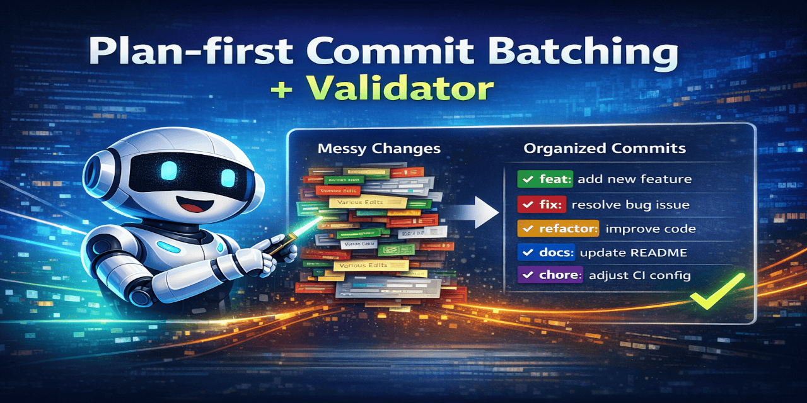

# conventional-commit-batcher

[](https://github.com/cnkang/conventional-commit-batcher/actions/workflows/ci.yml)
[](LICENSE)
[](https://github.com/cnkang/conventional-commit-batcher/releases)
[](https://skills.sh)

[中文文档](README.zh-CN.md)



Turn mixed local changes into clean, reviewable Conventional Commit batches.

## Why Use This Skill

- Plan-first workflow prevents accidental mixed commits.
- Clear batch boundaries make review, revert, and `git bisect` safer.
- Commit messages stay standards-compliant without manual policing.
- Built-in safety gates catch risky commits before they happen.

## Who This Is For

- Developers with a messy working tree before opening a PR.
- Teams that want cleaner commit history for release/changelog tooling.
- Agent-driven workflows that need deterministic commit hygiene.

## 30s Quick Try

### A) Install as an Agent Skill (recommended)

```bash
npx skills add cnkang/conventional-commit-batcher
npx skills list
```

Then ask your agent:

```text
I have mixed changes in my working tree.
1) Inspect git status and diff.
2) Produce a full Commit Plan with logical batches.
3) Wait for my confirmation.
4) After I approve, stage and commit each batch with Conventional Commit messages.
```

### B) Use git hooks (no agent required)

```bash
cat > .git/hooks/commit-msg <<'HOOK'
#!/usr/bin/env bash
set -euo pipefail

MSG_FILE="$1"
SCRIPT_PATH="scripts/validate_conventional_commit.py"

if [ ! -f "$SCRIPT_PATH" ]; then
  echo "[commit-msg] validator not found: $SCRIPT_PATH"
  exit 1
fi

python3 "$SCRIPT_PATH" \
  --file "$MSG_FILE" \
  --max-subject-length 72 \
  --max-header-length 100
HOOK

chmod +x .git/hooks/commit-msg

cat > .git/hooks/pre-commit <<'HOOK'
#!/usr/bin/env bash
set -euo pipefail

python3 scripts/precommit_safety_gate.py
HOOK

chmod +x .git/hooks/pre-commit
```

## What You Should Expect

When used correctly, the skill should always output a plan before any commit:

```text
Commit Plan
Batch #1: feat(scope): ...
Intent: ...
Files/Hunks:
- ...
Staging commands:
- git add ...
Commit command:
- git commit -m "feat(scope): ..."
```

## Built-In Safety Gates

The skill includes pre-commit guards for common beginner mistakes:

- secret/sensitive data accidentally staged
- local or generated files that should stay out of history (`.gitignore` drift)
- commits on protected/release branches by mistake
- unresolved merge conflict markers
- unexpected binary/large artifacts
- empty staged commit attempts

These checks are executed by `scripts/precommit_safety_gate.py` before each
commit attempt:

```bash
python3 scripts/precommit_safety_gate.py
```

- exit `0`: pass
- exit `2`: explicit user confirmation required (rerun with matching `--allow-*` flags after confirmation)
- exit `3`: hard block (must be fixed before commit)

If Python is unavailable, the agent must run the equivalent `git diff`/`git status`
manual checks from [`references/core-rules.md`](references/core-rules.md) and enforce
the same decisions.

## Why Scripts + No-Python Fallback

- No hard Python dependency: Python script is preferred, not mandatory.
- Why the script exists: it makes checks programmatic, regression-testable, and
  reusable in hooks/CI.
- If Python is not available: agent runs the same gate logic directly with
  `git` commands from [`references/core-rules.md`](references/core-rules.md),
  checks every gate one by one, and reports/block decisions in the same way.
- In both modes, when sensitive indicators are found, output includes triggered
  file paths, snippet evidence, and a "please review these files" suggestion.

## When To Use / Skip

Use it when:

- one branch contains mixed intents (`feat` + `fix` + `docs` + `style`)
- you need reviewable commit boundaries before PR
- you want consistent Conventional Commit history across contributors

Skip it when:

- you only have one tiny, single-intent change
- commit history hygiene is not relevant for the task

## Quick Start Paths

1. Agent flow: load this skill and follow [`references/core-rules.md`](references/core-rules.md).
2. Validator CLI (commit header): `python3 scripts/validate_conventional_commit.py "feat(scope): add ..."`.
3. Safety gate CLI (6 pre-commit checks): `python3 scripts/precommit_safety_gate.py`.
4. No-Python fallback: run manual gate commands in [`references/core-rules.md`](references/core-rules.md).
5. Hook flow: use the script above (or [`references/commit-msg-hook-example.md`](references/commit-msg-hook-example.md)).

## Agent-Specific Setup

Use these docs only for tool-specific setup details:

- Codex: [`references/codex-setup.md`](references/codex-setup.md)
- Claude Code: [`references/claude-setup.md`](references/claude-setup.md)
- Kiro CLI: [`references/kiro-setup.md`](references/kiro-setup.md)
- Kimi CLI: [`references/kimi-setup.md`](references/kimi-setup.md)
- Qwen Code: [`references/qwen-setup.md`](references/qwen-setup.md)
- Gemini CLI: [`references/gemini-setup.md`](references/gemini-setup.md)

## Core Rule Source

All entrypoints delegate to one canonical rule file:

- [`references/core-rules.md`](references/core-rules.md)

## Community and Feedback

- Bug reports and feature requests: GitHub Issues ([`.github/ISSUE_TEMPLATE/`](.github/ISSUE_TEMPLATE/))
- Product discussion and usage ideas: GitHub Discussions

## License

[Apache-2.0](LICENSE)
